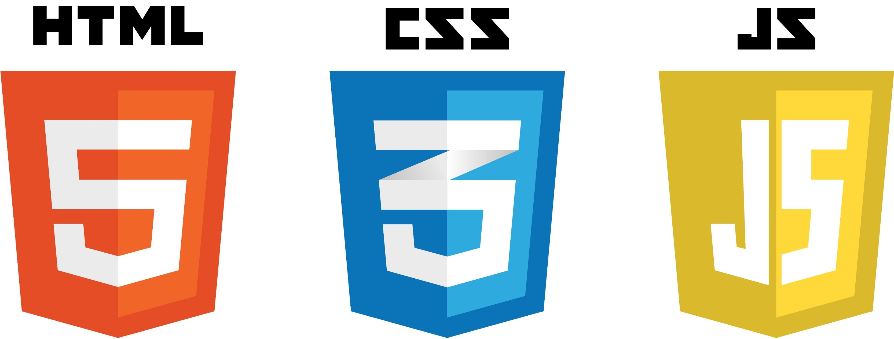

# :octocat: Welcome to Desmond Aldridge's GitHub :octocat: 

## A little about Desmond...

Desmond is an actor 🎭 and former travelling performer. 🎪  
He is currently enrolled in a full stack web development certification program.💻 
 
  
## 🌱 Technologies

### IDE, Dev Tools, & Communication

&nbsp;&nbsp;&nbsp;&nbsp;&nbsp;&nbsp;&nbsp;&nbsp;&nbsp;

#### Core Web Tech & Frameworks
&nbsp;&nbsp;

#### Frontend Frame 

&nbsp;&nbsp;&nbsp;&nbsp;&nbsp;&nbsp;&nbsp;&nbsp;&nbsp;&nbsp;&nbsp;&nbsp;

 

