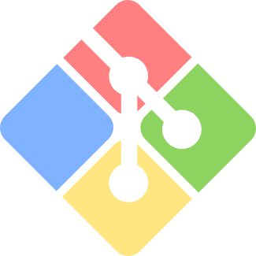

# :octocat: Welcome to Desmond Aldridge's GitHub :octocat: 
<!-- # DESMOND  -->

## 🎭 A little about Desmond... 

Game & Narrative Designer ⌨️🖥 | Actor (Film 🎬 & Live Entertainment 🎪) 
 
Full Stack Web Development CoC '21 💻 | Game Design BS '23 🎮
  
## 🌱 Technologies 

### GAME DESIGN

&nbsp;&nbsp;&nbsp;&nbsp;&nbsp;&nbsp;&nbsp;&nbsp;&nbsp;&nbsp;&nbsp;&nbsp;
<!--  -->

### WEB DEVELOPMENT

#### Solution Stack

&nbsp;&nbsp;&nbsp;&nbsp;&nbsp;

#### Foundational & Supplementary

&nbsp;&nbsp;&nbsp;&nbsp;&nbsp;&nbsp;&nbsp;&nbsp;&nbsp;&nbsp;&nbsp;&nbsp;&nbsp;&nbsp;&nbsp;

#### Developer Tools & Services

&nbsp;&nbsp;&nbsp;&nbsp;&nbsp;&nbsp;&nbsp;&nbsp;&nbsp;&nbsp;&nbsp;&nbsp;&nbsp;&nbsp;&nbsp;&nbsp;&nbsp;&nbsp;&nbsp;&nbsp;&nbsp;&nbsp;&nbsp;&nbsp;&nbsp;&nbsp;

 

